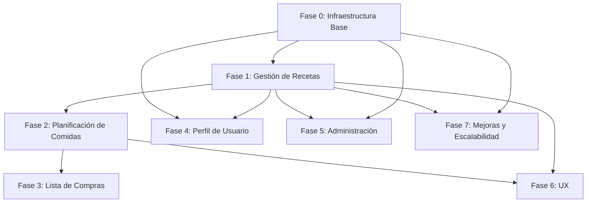

# Roadmap — Kitchos

## Estrategia de Ramas (Git Flow)

| Rama | Propósito | Origen | Fusión |
|------|-----------|--------|--------|
| `main` | Código listo para producción | — | — |
| `develop` | Integración de funcionalidades en desarrollo | `main` | `main` |
| `feature/<modulo>-<descripcion>` | Desarrollo de una funcionalidad específica | `develop` | `develop` |
| `release/v<version>` | Preparación de una versión para producción | `develop` | `main` y `develop` |
| `hotfix/<descripcion>` | Corrección urgente en producción | `main` | `main` y `develop` |

### Convención de nombres

```
feature/<modulo>-<accion-breve>
  Ej: feature/recetas-crud, feature/auth-identity, feature/mealplan-semanal

release/v<major>.<minor>.<patch>
  Ej: release/v1.0.0, release/v1.1.0

hotfix/<descripcion-breve>
  Ej: hotfix/fix-null-receta, hotfix/correccion-login
```

### Commits

Formato: `tipo(alcance): mensaje en español, presente imperativo`

```
feat(recetas): agregar CRUD básico de recetas
fix(recetas): corregir validación de ingredientes
chore: agregar configuracion de Entity Framework
refactor(domain): renombrar entidad Recipe
docs(readme): actualizar instrucciones de instalacion
```

---

## Roadmap de Módulos

### Fase 0 — Infraestructura Base (Fundación)

| # | Módulo | Rama | Descripción |
|---|--------|------|-------------|
| 0.1 | **Configuración EF Core + MySQL** | `feature/infra-database` | Agregar paquetes NuGet EF Core, crear `AppDbContext`, configurar cadena de conexión (MySQL para desarrollo), crear `DesignTimeDbContextFactory`. |
| 0.2 | **Entidades del Dominio** | `feature/domain-entities` | Crear entidades base: `Recipe`, `Ingredient`, `Category`, `Tag`, `MealPlan`, `MealPlanDay`, `ShoppingList`, `ShoppingListItem`, `Review`, `Favorite`, `UnitOfMeasure`. |
| 0.3 | **Repositorios Genéricos** | `feature/infra-repositories` | Interfaces: `IRepository<T>`, `IUnitOfWork`. Implementaciones con EF Core. |
| 0.4 | **Seed Data** | `feature/infra-seed` | Datos iniciales: categorías por defecto, unidades de medida. |
| 0.5 | **Autenticación (Identity)** | `feature/auth-identity` | Configurar ASP.NET Core Identity, páginas de registro/login, roles (Admin, User). |

### Fase 1 — Gestión de Recetas (Core)

| # | Módulo | Rama | Descripción |
|---|--------|------|-------------|
| 1.1 | **CRUD de Categorías** | `feature/categorias-crud` | ABM de categorías con vista MVC. Solo administradores pueden crear/editar/eliminar. |
| 1.2 | **CRUD de Recetas** | `feature/recetas-crud` | ABM de recetas con ingredientes, instrucciones paso a paso, tiempo de preparación, dificultad, foto. |
| 1.3 | **Búsqueda y Filtros** | `feature/recetas-busqueda` | Búsqueda por nombre, filtros por categoría, ingrediente, tiempo, dificultad. |
| 1.4 | **Detalle de Receta** | `feature/recetas-detalle` | Página de detalle con info completa, foto, valoración, reviews. |
| 1.5 | **Reviews y Valoraciones** | `feature/recetas-reviews` | Sistema de estrellas (1-5) y comentarios por receta. |
| 1.6 | **Favoritos** | `feature/recetas-favoritos` | Marcar/desmarcar recetas como favoritas, listado de favoritos del usuario. |
| 1.7 | **Imágenes de Recetas** | `feature/recetas-imagenes` | Subida y optimización de imágenes, almacenamiento local o en la nube. |

### Fase 2 — Planificación de Comidas (Meal Planning)

| # | Módulo | Rama | Descripción |
|---|--------|------|-------------|
| 2.1 | **Plan Semanal** | `feature/mealplan-semanal` | Vista semanal (lunes a domingo) con desayuno, almuerzo, cena, snacks. Asignar recetas a cada espacio. |
| 2.2 | **CRUD de Planes** | `feature/mealplan-crud` | Crear, editar, eliminar planes semanales. Histórico de planes anteriores. |
| 2.3 | **Plan desde Receta** | `feature/mealplan-desde-receta` | Botón "Agregar al plan" desde la receta, seleccionando día y comida. |
| 2.4 | **Calendario** | `feature/mealplan-calendario` | Vista de calendario mensual para planificar a largo plazo. |

### Fase 3 — Lista de Compras

| # | Módulo | Rama | Descripción |
|---|--------|------|-------------|
| 3.1 | **Generación Automática** | `feature/compras-generacion` | Generar lista de compras a partir del plan semanal, agrupando ingredientes y cantidades. |
| 3.2 | **Lista Interactiva** | `feature/compras-interactiva` | Checkboxes para marcar items comprados, editar cantidades, agregar items manuales. |
| 3.3 | **Exportar/Compartir** | `feature/compras-exportar` | Exportar lista a texto, PDF o compartir por link. |

### Fase 4 — Perfil de Usuario y Preferencias

| # | Módulo | Rama | Descripción |
|---|--------|------|-------------|
| 4.1 | **Perfil de Usuario** | `feature/perfil-usuario` | Editar perfil, foto, preferencias alimenticias (vegetariano, vegano, sin gluten, etc.). |
| 4.2 | **Mis Recetas** | `feature/perfil-misrecetas` | Listado de recetas creadas por el usuario, gestion de recetas propias. |
| 4.3 | **Estadísticas** | `feature/perfil-estadisticas` | Recetas cocinadas, reviews escritas, racha de planificación. |

### Fase 5 — Administración (Panel Admin)

| # | Módulo | Rama | Descripción |
|---|--------|------|-------------|
| 5.1 | **Dashboard Admin** | `feature/admin-dashboard` | Panel con métricas: usuarios registrados, recetas creadas, actividad reciente. |
| 5.2 | **Gestión de Usuarios** | `feature/admin-usuarios` | Listado de usuarios, roles, bloquear/eliminar. |
| 5.3 | **Gestión de Contenido** | `feature/admin-contenido` | Moderar recetas, reviews, categorías. |

### Fase 6 — Experiencia y UX

| # | Módulo | Rama | Descripción |
|---|--------|------|-------------|
| 6.1 | **Modo Oscuro** | `feature/ux-darkmode` | Alternar tema claro/oscuro con persistencia en localStorage. |
| 6.2 | **Responsive Design** | `feature/ux-responsive` | Asegurar que todas las vistas funcionan en mobile, tablet y desktop. |
| 6.3 | **Carga Progresiva** | `feature/ux-paginacion` | Paginación e infinite scroll en listados de recetas. |
| 6.4 | **Notificaciones** | `feature/ux-notificaciones` | Toast/alertas para acciones exitosas o errores. |

### Fase 7 — Mejoras y Escalabilidad

| # | Módulo | Rama | Descripción |
|---|--------|------|-------------|
| 7.1 | **Tests Unitarios (Domain)** | `feature/tests-domain` | Pruebas unitarias con xUnit para entidades y servicios de dominio. |
| 7.2 | **Tests de Integración (Infra)** | `feature/tests-integration` | Pruebas de integración con base de datos en memoria. |
| 7.3 | **Tests Funcionales (Web)** | `feature/tests-functional` | Pruebas de controladores y vistas. |
| 7.4 | **API REST** | `feature/api-rest` | Endpoints RESTful para integraciones externas (app mobile, terceros). |
| 7.5 | **Documentación Técnica** | `feature/docs-tecnicas` | Documentar arquitectura, decisiones técnicas, guías de contribución. |
| 7.6 | **Dockerización** | `feature/infra-docker` | Dockerfile y docker-compose para desarrollo y producción. |
| 7.7 | **CI/CD** | `feature/infra-cicd` | Pipeline de GitHub Actions para build, test y deploy. |

---

## Dependencias Entre Fases



---

## Prioridades Recomendadas

1. **Fase 0** (completa) — Sin esto no se puede construir nada.
2. **Fase 1** (mínimo: 1.1, 1.2, 1.4) — El core del negocio.
3. **Fase 2 + 3** — Diferenciador principal de la app.
4. **Fase 4 + 5 + 6** — Madurez del producto.
5. **Fase 7** — Preparación para producción y escalabilidad.

Cada fase debe completar todos sus items antes de avanzar a la siguiente. Excepciones: items marcados como posteriores dentro de una misma fase pueden moverse si hay bloqueantes externos.
